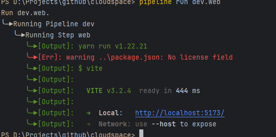

一个rust写的windows平台的构建工具，用于快捷执行一系列脚本。该命令行工具的想法来源是pipelight,但是pipelight不支持windows，所以写了这个工具。
### 安装
使用cargo进行安装
```powershell
cargo install pipeline-cli
```

### 内建函数

- pipeline(pipeline_name:String,closure:Closure):包裹一组由step和parallel组成的任务
- step(name:String,closure:Closure) 一个普通的任务，会阻塞后面的任务执行
- parallel(name:String,closure:Closure) 一个并行的任务，不会阻塞后面的任务执行
- cmd(command:String) 执行一条powershell命令
- workspace(path:String) 切换当前命令的工作空间，影响cmd，movefile,replace函数中路径的书写
- move(source_path:String,target_path:String) 将一个文件从source_path移动到target_path处，如果target_path路径不存在会尝试创建一系列文件夹
- replace(file_path:String,regex:String,replace_content:String) 通过正则将file_path处的文件中的内容替换成replace_content
- copy(source_path:String,target_path:String) 将一个文件从source_path复制到target_path处,如果target_path路径不存在会尝试创建一系列文件夹
### Examples
需要在项目目录下添加一个名为pipeline.kts的文件，文件语法采用kotlin dsl语法，仅支持函数使用内建函数进行调用

一个pipeline.kts的例子:
```kotlin
pipeline("dev"){
    step("web"){
        workspace("./web")
        cmd("yarn dev")
    }
    step("tailwind"){
        workspace("./web")
        cmd("npx tailwindcss -i./src/style.css -o./src/output.css --watch")
    }
    step("go"){
        workspace("./test")
        copy("cmd/main.go","t/main.go")
        move("t/main.go","cmd/main.go")
    }
}
pipeline("hz"){
    step("new"){
         workspace("./")
         cmd("hz new -module github.com/yanguiyuan/cloudspace -idl idl/api/api.thrift")
         cmd("go mod tidy")
    }
    step("clean"){
        workspace("./")
        cmd("Remove-Item -Path ./biz -Recurse ")
        cmd("Remove-Item -Path ./script -Recurse ")
        cmd("del ./.hz")
        cmd("del ./build.sh")
        cmd("del ./router.go")
        cmd("del ./router_gen.go")
        cmd("del ./main.go")
    }
}
```
1.执行Pipeline dev下的Step web相关命令：

```powershell
pipeline run dev.web
或者运行dev下的所有step
pipeline run dev
```

2.列出所有的任务

```powershell
pipeline list
```
3.初始化项目使用模板

```powershell
pipeline init -t <template_name>
//或者
pipeline init --template <template_name>
//例如
pipeline init -t hertz-vue
```
4.列出所有可用的模版（模版存放在用户目录的.pipeline目录下，可能需要你手动创建目录）

```powershell
pipeline template
```
5.将当前项目中的pipeline.kts保存为模版

```powershell
pipeline template -a/--add <template_name>
```
6.移除指定模版

```powershell
pipeline template -r/--remove <template_name>
```